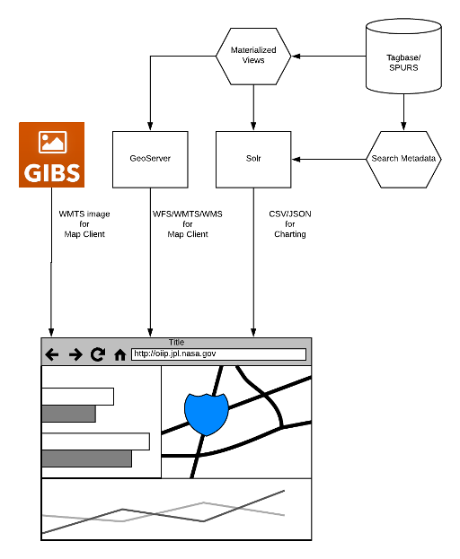
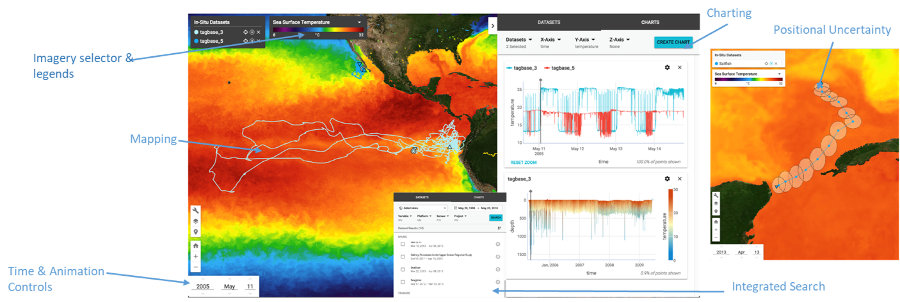

## Welcome to OIIP Services

OIIP Services provides the back-end infrastructure services for the Oceanographic In-situ Data Interoperability Project (OIIP).
It comprises of GeoServer and Solr.

* [/](./) contains documentation and a sample Dockerfile demonstrating a typical deployment of the services via GeoServer and Solr
* [geoserver/](geoserver/) contains shapefiles and styles used by OIIP
* [solr/oiip/](solr/oiip/) contains Solr configurations for OIIP using Tagbase in PostGIS
* [solr/oiip_access/](solr/oiip_access/) contains test Solr configurations for OIIP using Tagbase in Access
* [sql/](sql/) contains SQL commands for PostGIS to generate materialized views used by GeoServer to query point values

### Development Instructions

**Build Docker image**

    docker build --no-cache -t oiip-services:latest .

**Run Docker image**

    docker run -d --rm --name oiip-services -p 8080:8080 -p 8983:8983 oiip-services:latest

**Note: The Docker image is intended as a reference for development and not for operational environments.**

Review the [Dockerfile](Dockerfile) to understand how software is configured.

### Architecture

OIIP Services relies on the following components:

* Solr - data service for charting and search
* GeoServer - data service for mapping
* PostGIS - data storage

#### Solr

OIIP data is indexed into Solr for high perfomance data queries. It is used by the OIIP Data Viewer primarily for charting and search.

#### GeoServer

GeoServer provides GIS data services for OIIP. It is the primary map server for the OIIP Data Viewer.

####PostGIS

OIIP data is stored in a PostGIS database. This repository does not contain configurations or data for PostGIS. Other databases supporting spatial data types should work as well.

### Reference Client

Check out [OIIP Data Viewer](https://github.com/oiip/oiip-data-viewer) for information about the client.

